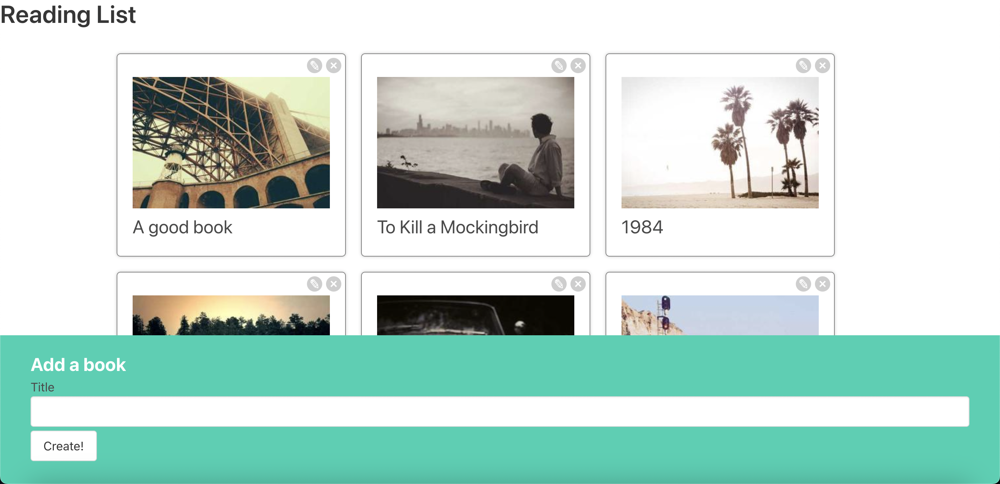
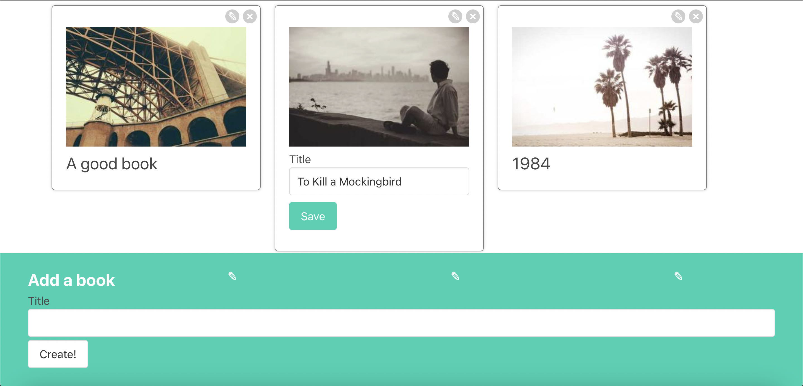

# BookList







> Front-end using React.js
> Using json-server on the backend

Features:

- Create the book
- Edit the book
- Delete the book

### Install packages

```bash
npm i
```

### In two separate terminal windows, run the following commands:

Terminal Window 1:

```bash
npm start
```

Terminal Window 2:

```bash
npm run server
```
